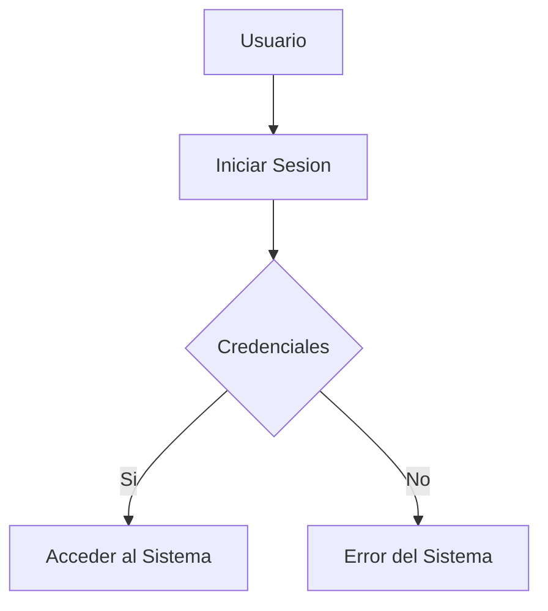

# Adrian Torres

# Indice
-[Titulo](#titulo-importante)
-[Subtitulo1](#subtitulo-1)
-[Subtitullo2](#subtitulo-2)
-[Hipervinculo](#creando-hipervinculo)
-[Imagenes](#colocando-imagenes)
-[Funciones](#funciones)
-[Tablas](#creando-tabla)
-[Codigo](#código)
-[Diagrama](#mermaid-diagramas)
-[Diagrama2](#diagrama-de-tecsup)

# Titulo Importante
Aprendiendo *Markdown* en las clases del profesor Luis Pallin

## Subtitulo 1
Aqui veremos como formatear diferentes **tipos de textos**.

## Subtitulo 2
Podremos conocer diferentes tipos de formato de textos usando ~Markdown~.

### Creando Hipervinculo 

[Google](https://www.Google.com)
[Tecsup](https://ww.tecsup.edu.pe)

## Colocando Imagenes 


## Funciones

-[X]
-[X]
-[]
-[]

## Creando Tabla

|Lenguaje de Programacion|Creador|
|------------------------|-------|
|Java|James Cosling|
|PHP|Rasmus Lerder|
|Python|Guido van Rossum|

## Código
``` --html
<h1>Hola Mudo</h1>
```
```css
body{
    background:"red";
}
```
```java
public class Trabajo{
    public static void main(string[] args){
        System.out.println("Hola a Todos");
    }
}
```
``` JavaScript
function saludar() {
    console.log("¡Hola!");
}

saludar();
```

## Mermaid Diagramas


## Diagrama de Tecsup
```mermaid
flowchart TD
A[Materia] --> B[Concepto]
B --> C{Tipos}
C --> D[Solido]
C --> E[Liquido]
C --> F[Gaseoso]
